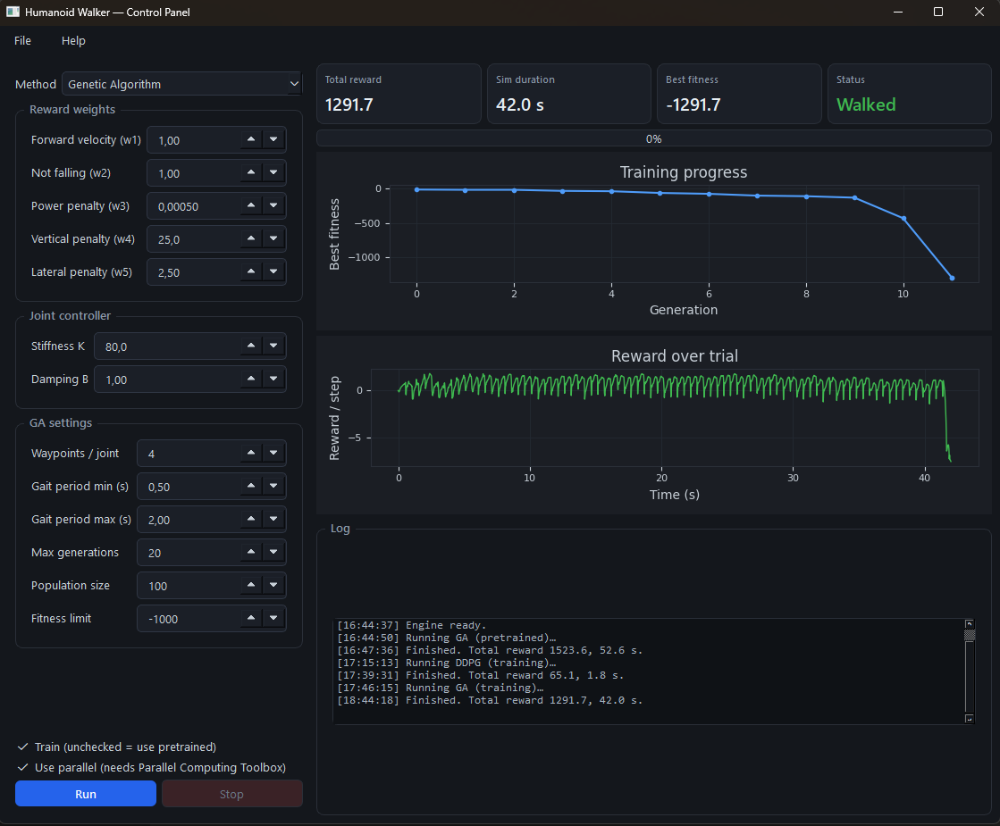
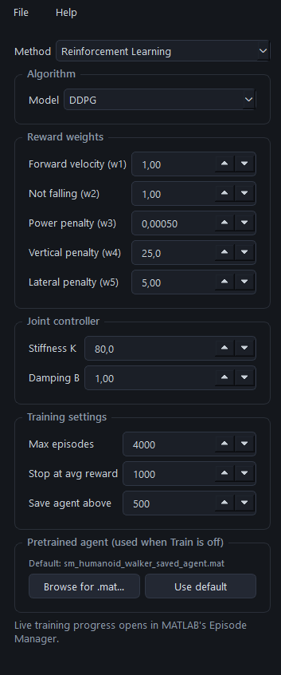

# Humanoid Walker — Control GUI


A **Python/PySide6 desktop application** that trains a simulated humanoid to walk,
driving a MATLAB/Simulink **Simscape Multibody** physics model through the MATLAB
Engine. One control panel, two learning paradigms — a **genetic algorithm** and
**reinforcement learning** (DDPG / TD3 / SAC) — with live training feedback, results
plotted back in the GUI, and the 3-D gait rendered in Simulink's Mechanics Explorer.

<p align="center">
  <br>
  <em>A gait trained by the genetic algorithm — 42 seconds of stable walking.</em>
</p>

> Built as a software-engineering layer around a proprietary robotics simulation:
> a decoupled Python GUI, a thin MATLAB bridge, background-threaded execution, and a
> full CI/CD pipeline. The humanoid model itself is MathWorks' example
> (see [Attribution](#attribution--licensing)); the value added here is the
> surrounding application, the multi-algorithm training, and the engineering.

---

## Highlights

- **Four training methods, one dropdown** — a genetic algorithm plus three RL
  algorithms (DDPG, TD3, SAC), all driving the same environment and reward so they
  can be compared head-to-head.
- **Trains a walker that actually walks** — the GA reliably converges to a stable
  42-second gait (see results below).
- **Live training feedback** — the GA's best-fitness-per-generation streams into the
  GUI in real time; RL episode rewards are plotted on completion.
- **Instant pretrained playback** — uncheck *Train* to load a ready-made agent (or
  your own saved `.mat`) and simulate it in seconds.
- **Correct concurrency** — the MATLAB engine runs on a background thread, so the UI
  never freezes during multi-minute training runs.
- **Full CI/CD** — GitHub Actions lint, format, and test on every push across Python
  3.9–3.12.

---

## The GUI

<p align="center">
  
</p>

A parameter rail on the left (reward weights, joint controller, method-specific
settings) and results on the right: headline metrics, a live training-progress plot,
the reward-over-trial trace, and a timestamped log. The screenshot above shows a
GA-trained walker: total reward 1291.7 over a 42-second trial, status **Walked**. The
clean oscillation in the reward trace is one bump per stride — the signature of a
stable gait.

The RL panel adds an algorithm selector for **DDPG / TD3 / SAC**:

<p align="center">
  
</p>

---

## Results — genetic algorithm vs reinforcement learning

Both paradigms optimise the same reward
(`r = w1·v_y + w2·Ts − w3·power − w4·Δz − w5·Δx`, summed over the trial), but they
behave very differently on this task.

| Run | Method | Total reward | Trial length | Outcome |
|---|---|---|---|---|
| Reference | GA (pretrained) | 1523.6 | 52.6 s | Walks |
| **Trained here** | **GA (11 generations)** | **1291.7** | **42.0 s** | **Walks** |
| Trained here | DDPG | 65.1 | 1.8 s | Stands, then falls |

**The genetic algorithm learns to walk; model-free RL converges to a standing local
optimum.** The GA optimises the *whole trajectory's* forward progress, so it is pulled
toward locomotion — its fitness dropped from −18 to below −1290 in eleven generations
and crossed the early-stop target. The RL agents (DDPG/TD3/SAC) optimise *per-timestep*
reward, and repeatedly discover that standing still is a safe way to collect the
survival term while stepping risks a fall — a textbook local optimum. Escaping it needs
reward reshaping (stronger forward-velocity weight, weaker survival term) and much
longer training with better exploration.

For this humanoid task, the structured gait search beats exploration-based RL — which
is exactly why the original example ships a *genetic-algorithm* pretrained solution
rather than an RL one.

---

## Architecture

```
Python GUI (PySide6)                MATLAB Engine                 Simulink / Simscape
──────────────────────   JSON args  ─────────────  set params    ───────────────────
 parameter panels    ─────────────▶ gui_run_ga.m  ────────────▶  sm_humanoid_walker_ga
 Run / Stop                         gui_run_rl.m                  sm_humanoid_walker_rl
 live plots + log    ◀───────────── numeric arrays ◀──────────── logged reward signal
```

The GUI never manipulates MATLAB workspace variables directly. It passes a **JSON**
bundle of overrides to one of two **bridge functions** (`matlab_bridge/*.m`), which
apply them onto the real parameter struct, run training, and return plain numeric
arrays. This decouples the GUI from MATLAB internals, keeps the MathWorks example files
untouched, and gives Python a single clean call per run.

Concurrency: the MATLAB engine runs on a background `QThread`; results are marshalled
back to the GUI thread via Qt signals. GA progress is streamed by having the MATLAB
`OutputFcn` append each generation's best fitness to a CSV that the GUI polls — a simple,
robust channel for getting intermediate values out of an otherwise-blocking call.

---

## The two paradigms

| | Genetic algorithm | Reinforcement learning |
|---|---|---|
| Controller | Open-loop repeating gait | Closed-loop feedback policy |
| Optimises | 13 vars: 12 joint waypoints + gait period | Actor / critic network weights |
| Algorithms | `ga` (Global Optimization Toolbox) | DDPG, TD3, SAC |
| Live view | Streams into the GUI | MATLAB Episode Manager |
| Typical runtime | Minutes | Hours |

The robot's joints are modelled as spring-dampers: torque `τ = B·θ̇ + K·(θ₀ − θ)`,
where the *setpoint* `θ₀` is what gets optimised — the physics handles low-level
stabilisation, which makes the search space far friendlier. Foot-ground contact uses
small contact spheres rather than full-geometry collision, for simulation speed.

---

## Setup

Requires a local MATLAB **R2025b** install (full install, not Runtime) with the
relevant toolboxes, and a compatible Python (3.9–3.12).

```bash
pip install -r requirements.txt
pip install matlabengine==25.2.*     # must match your MATLAB release
```

Point the app at your copy of the example (obtained via `openExample`, see
[Attribution](#attribution--licensing)):

```bash
# Windows
set HW_PROJECT_DIR=C:\path\to\TrainHumanoidWalkerExample
# or edit PROJECT_DIR at the top of app/main.py
```

Run:

```bash
python -m app.main
```

The window opens immediately and starts the MATLAB engine in the background; *Run*
enables once it reports **Engine ready**.

**Toolboxes:** GA path needs Global Optimization Toolbox (+ Parallel Computing Toolbox
only if *Use parallel* is ticked). RL path needs Deep Learning Toolbox + Reinforcement
Learning Toolbox. All require Simscape Multibody.

---

## Usage

1. Choose **Genetic Algorithm** or **Reinforcement Learning** (and, for RL, the
   algorithm: DDPG / TD3 / SAC).
2. Adjust reward weights, joint controller, and method settings.
3. Leave **Train** unchecked to play a pretrained result in seconds, or check it to
   train from scratch. For RL you can browse to your own trained-agent `.mat`.
4. **Run.** GA fitness streams into the top plot; the reward trace, metrics, and log
   fill in on completion, and the gait renders in Mechanics Explorer.

---

## Development

```bash
pip install -e ".[dev]"      # ruff + pytest
pre-commit install           # optional: format/lint on commit
ruff check . && ruff format --check .
pytest -q                    # pure-Python tests, no MATLAB needed
```

## Continuous integration

`.github/workflows/ci.yml` runs on every push/PR across Python 3.9–3.12: ruff lint,
ruff format check, byte-compile, and pytest. CI deliberately does **not** run MATLAB —
hosted runners have no MATLAB licence — so the tests cover the MATLAB-independent seam
(array conversion, progress-file parsing, stop-flag handling). Testing the code you own
rather than mocking a licensed engine is the honest pattern for a project like this.

## Project layout

```
app/            PySide6 GUI + MATLAB-engine threading
matlab_bridge/  thin .m wrappers (gui_run_ga, gui_run_rl)
tests/          pure-Python tests
.github/        CI workflow
docs/           screenshots and gait recording
```

---

## Attribution & licensing

The original code in this repository (the PySide6 GUI in `app/` and the bridge scripts
in `matlab_bridge/`) is released under the **MIT License** (see `LICENSE`).

The humanoid model, Simulink models, CAD geometry, and example scripts
(`sm_humanoid_walker_*`, `.slx`, `.stp`, `.mat`, `.mlx`) are **Copyright The MathWorks,
Inc.** and are **not** distributed here. Obtain them from a licensed MATLAB install:

```matlab
openExample("sm/ImportedURDFExample")
```

Then point `HW_PROJECT_DIR` at that folder.

## Author

**Smithil Wadkar** — [GitHub @Smithil23](https://github.com/Smithil23)
